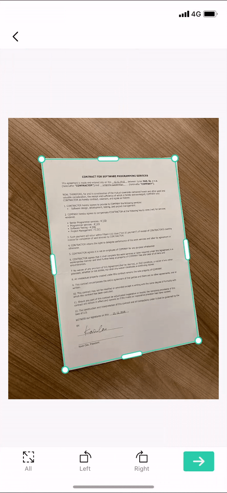

# GoodScanner

- TODO

  - OpenCV Android 프로젝트에 설치

    - https://webnautes.tistory.com/923

  - Gaussian Blurring 과 같은 기술을 이용하여 Image의 noise 제거

  - OpenCV를 이용한 Document Edge Detection

    - https://www.pyimagesearch.com/2014/09/01/build-kick-ass-mobile-document-scanner-just-5-minutes/

  - Edge Detection 결과를 이용한 Document Contour(Outline) 찾기

  - OpenCV의 Perspective Transform을 이용해서 정면화하기

    - https://www.pyimagesearch.com/2014/08/25/4-point-opencv-getperspective-transform-example/

  - 정면화 + De-noise 한 image를 이용하여 Text Recognition 모델 결과 뽑기

    

  - Model 결과를 이용하여 실제 document처럼 docx(?) 파일 구성하기

    

# Text Recognition Details

- Text Recognition 동작 과정

  - StillImageActivity.kt
    - onGlobalLayout(), onActivityResult()에서 호출되는 **tryReloadAndDetectInImage()**로부터 시작
    - tryReloadAndDetectInImage()
      - imageUri에 저장된 image의 주소를 이용하여 BitmapUtils.getBitmapFromContentUri()로 image의 Bitmap을 추출한다
      - Bitmap의 size를 옵션에 따라 맞추고 Text Recognition용 AI model에서 사용하는 input size에 맞게 resize하여 resizedBitmap에 저장.
      - imageProcessor!!.processBitmap(resizedBitmap, graphicOverlay)를 이용해서 resizedBitmap에 대한  결과를 graphicOverlay에 나타낸다.
        - imageProcessor = TextRecognitionProcessor(this, KoreanTextRecognizerOptions.Builder().build())
        - processBitmap()은 VisionProcessorBase.kt에 존재함
  - VisionProcessorBase.kt
    - processBitmap()
      - requestDetectInImage() 호출
    - requestDetectInImage()
      - tryReloadAndDetectInImage()의 resizedBitmap을 input(image: InputImage)으로 사용
      - setUpListener호출
        - detectInImage(image) 호출
        - detectInImage()에 OnSuccessListener와 OnFailureListener 등록(addOnSuccessListener, addOnFailureListener)
          - this@VisionProcessorBase.onSuccess(results, graphicOverlay)
          - this@VisionProcessorBase.onFailure(e)
  - TextRecognitionProcessor.kt
    - detectInImage()
      - VisionProcessorBase.kt는 abstract fun이고 실제 구현은 TextRecognitionProcessor.kt에 존재함
      - textRecognizer.process(image) 호출
      - textRecognizer: TextRecognizer = TextRecognition.getClient(textRecognizerOptions)
    - process()
      - 실제 AI model을 돌린다
      - 코드는 아마 JNI를 이용하여 Native code를 돌리는 것일 것이기 때문에 볼 수는 없고 우리는 OnSuccessListner인 onSuccess()와 OnFailureListner인 onFailure()만 살펴보면된다
    - onSuccess()
      - graphicOverlay에 TextGraphic(graphicOverlay, text, shouldGroupRecognizedTextInBlocks)로 인식한 text정보 추가
      - text 정보들이 모두 add 되면 TextGraphic.kt의 draw()를 이용하여 화면에 출력한다

- 요약

  - Text Recognition 결과가 들어있는 변수들
    - VisionProcessorBase.kt
      - this@VisionProcessorBase.onSuccess(**results**, graphicOverlay)
    - TextRecognitionProcessor.kt
      - onSuccess(**text**: Text, graphicOverlay: com.good.scanner.GraphicOverlay)
    - TextGraphic.kt
      - private val **text**: Text
      - 여기서 Text의 class 형태를 대충 볼 수 있다.

- Text class 정보

  - text.text: 확인필요

  - text.textBlocks에 실제 detection된 여러개의 textblock들이 존재하고 이를 for문으로 받아서 정보를 추출

    ```kotlin
    for (textBlock in text.textBlocks) { // Renders the text at the bottom of the box.
      Log.d(TAG, "TextBlock text is: " + textBlock.text)
      Log.d(TAG, "TextBlock boundingbox is: " + textBlock.boundingBox)
      Log.d(TAG, "TextBlock cornerpoint is: " + Arrays.toString(textBlock.cornerPoints))
    ```

  - 각 textblock안에는 다시 lines가 존재하여 for문으로 받아서 정보를 추출한다

    ```kotlin
    for (line in textBlock.lines) {
      Log.d(TAG, "Line text is: " + line.text)
      Log.d(TAG, "Line boundingbox is: " + line.boundingBox)
      Log.d(TAG, "Line cornerpoint is: " + Arrays.toString(line.cornerPoints))
    ```

  - 각 line안에는 다시 elements가 존재하여 for문으로 받아서 정보를 추출한다

    ```kotlin
    for (element in line.elements) {
      Log.d(TAG, "Element text is: " + element.text)
      Log.d(TAG, "Element boundingbox is: " + element.boundingBox)
      Log.d(TAG, "Element cornerpoint is: " + Arrays.toString(element.cornerPoints))
      Log.d(TAG, "Element language is: " + element.recognizedLanguage)
    ```